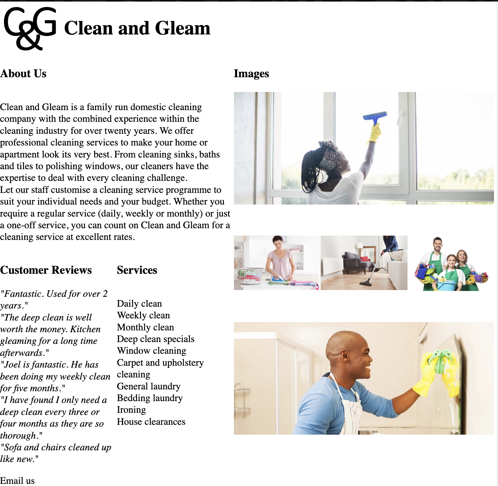

# Layout CSS

## Answer to something

```css
body {
    margin: 0;
    width: 100vw;
    height: 100vh;
}

main {
    width: 100%;
    height: 100%;
    display: grid;
    grid-template-rows: min-content auto min-content;
}
```

Got rid of the margins in `body`, and made it cover the whole screen

Added 3 rows to the grid. `min-content` will try to shrink that element as much as it can. `auto` will try expand that element as much as it can.

If you don't like your site looking like an Alex Turner presentation, then you can go back to your old HTML structure

```html
<main class="grid-wrapper">
    <header class="header"></header>
    <section class="content"></section>
    <footer class="footer"></footer>
</main>
```


## Header Layout

Now let's move onto styling the header


1) We'll put the logo image (logo.jpg from assets)
    - Make sure width is 100px
    - Make it inline (to order the elements from left to right instead of up-down)

2) And then we'll add the header title
    - Set size to 40px
    - Make it inline
    - Make it bold

This is how it should look like


### Answer

HTML

```html
<main class="grid-wrapper">
    <header class="header">
        
        <h1 class="header-title"><strong>Clean and Gleam</strong></h1>
    </header>
    <section class="content"></section>
    <footer></footer>
</main>
```

CSS

```css
img.logo {
    width: 100px;
}

.header * {
    display: inline;
    vertical-align: middle;
}
```

>`<strong>` makes it bold. `.header *` selects all of the header's children because they individiually have to be set to `inline`


## Content Layout

We'll use the grids bc it's easier for layout

### Text Area


1) Make a 2x4 grid
    - Merge the first two column elements together to create the About Us section (`grid-column: 1 / 3;`)
    - Heading should be `min-content` and the paragraphs should be `auto` so that the paragraph size can expand (when setting templates)

2) Put the content of each suitable .txt into the text areas
    - Make sure you put suitable line breaks `<br>`

3) Headings should have a 20px size

4) Make the services list a bulletpointed list

5) Italicise custom review text `<i>`

6) Display **About us** and **Custom Reviews** texts as `justified`

This is how it should look like 


### Text Area answer

CSS
```css
.content {
    display: grid;
    grid-template-columns: 380px auto;
}

.text-area {
    display: grid;
    grid-template-columns: 50% 50%;
    grid-template-rows: min-content auto min-content auto;
}
```

HTML
```html
<main class="grid-wrapper">
    <header class="header">
        
        <h1 class="header-title"><strong>Clean and Gleam</strong></h1>
    </header>
    <section class="content">
        <div class="text-area">
            <h3 style="grid-row: 1; grid-column: 1 / 3;">About Us</h3>
            <p  style="grid-row: 2; grid-column: 1 / 3;">
                Clean and Gleam is a family run domestic cleaning company with the combined experience within the cleaning industry for over twenty years. We offer professional cleaning services to make your home or apartment look its very best. From cleaning sinks, baths and tiles to polishing windows, our cleaners have the expertise to deal with every cleaning challenge.<br>
                Let our staff customise a cleaning service programme to suit your individual needs and your budget. Whether you require a regular service (daily, weekly or monthly) or just a one-off service, you can count on Clean and Gleam for a cleaning service at excellent rates.
            </p>
            <h3 style="grid-row: 3; grid-column: 1;">Customer Reviews</h3>
            <p  style="grid-row: 4; grid-column: 1;">
                "Fantastic. Used for over 2 years."<br>
                "The deep clean is well worth the money. Kitchen gleaming for a long time afterwards."<br>
                "Joel is fantastic. He has been doing my weekly clean for five months."<br>
                "I have found I only need a deep clean every three or four months as they are so thorough."<br>
                "Sofa and chairs cleaned up like new."
            </p>
            <h3 style="grid-row: 3; grid-column: 2;">Services</h3>
            <p  style="grid-row: 4; grid-column: 2;">
                Daily clean<br>
                Weekly clean<br>
                Monthly clean<br>
                Deep clean specials<br>
                Window cleaning<br>
                Carpet and upholstery cleaning<br>
                General laundry<br>
                Bedding laundry<br>
                Ironing<br>
                House clearances
            </p>
        </div>
    </section>
    <footer class="footer"></footer>
</main>
```

### Image Area


1) Make a 3x4 grid to contain the images
    - Make the 3 columns have equal spacing (`grid-template-columns: 33% 33% 33%`)
    - Make 4 rows, 1st will be `min-content` (for the heading) and the rest will be `auto`
    - Include the appropriate image sources
    - The top and bottom elements must span across 3 COLUMNS `grid-column: 1 / 4;`

Here's how that should look like


### Image Area answer

HTML
```html
<div class="image-area">
    <h3 class="heading" style="grid-template-columns: 1 / 4;">Images</h3>
    
    
    
    
    
</div>
```

CSS 
```css
.image-area {
    display: grid;
    grid-template-columns: 33% 33% 33%;
    grid-template-rows: min-content auto auto auto;
}

.image-area img {
    width: 100%;
    height: auto;
}
```

## Footer


## Layout Result

When combining everything:



HTML
```html
<!DOCTYPE HTML>
<html lang="en">
    <head>
        <title>Clean and Gleam</title>
        <meta charset="utf-8">
        <meta name="keywords" content="">
        <meta name="description" content="My description">
        <meta name="viewport" content="width=device-width, initial-scale=1.0">
        <link rel="stylesheet" href="styles.css">
    </head>
    <body>
        <main class="grid-wrapper">
            <header class="header">
                
                <h1 class="header-title"><strong>Clean and Gleam</strong></h1>
            </header>
            <section class="content">
                <div class="text-area">
                    <h3 class="heading" style="grid-row: 1; grid-column: 1 / 3;">About Us</h3>
                    <p  class="justified" style="grid-row: 2; grid-column: 1 / 3;">
                        Clean and Gleam is a family run domestic cleaning company with the combined experience within the cleaning industry for over twenty years. We offer professional cleaning services to make your home or apartment look its very best. From cleaning sinks, baths and tiles to polishing windows, our cleaners have the expertise to deal with every cleaning challenge.<br>
                        Let our staff customise a cleaning service programme to suit your individual needs and your budget. Whether you require a regular service (daily, weekly or monthly) or just a one-off service, you can count on Clean and Gleam for a cleaning service at excellent rates.
                    </p>
                    <h3 class="heading justified" style="grid-row: 3; grid-column: 1;">Customer Reviews</h3>
                    <i  style="grid-row: 4; grid-column: 1;">
                        "Fantastic. Used for over 2 years."<br>
                        "The deep clean is well worth the money. Kitchen gleaming for a long time afterwards."<br>
                        "Joel is fantastic. He has been doing my weekly clean for five months."<br>
                        "I have found I only need a deep clean every three or four months as they are so thorough."<br>
                        "Sofa and chairs cleaned up like new."
                    </i>
                    <h3 class="heading" style="grid-row: 3; grid-column: 2;">Services</h3>
                    <p  style="grid-row: 4; grid-column: 2;">
                        Daily clean<br>
                        Weekly clean<br>
                        Monthly clean<br>
                        Deep clean specials<br>
                        Window cleaning<br>
                        Carpet and upholstery cleaning<br>
                        General laundry<br>
                        Bedding laundry<br>
                        Ironing<br>
                        House clearances
                    </p>
                </div>
                <div class="image-area">
                    <h3 class="heading" style="grid-template-columns: 1 / 4;">Images</h3>
                    
                    
                    
                    
                    
                </div>
            </section>
            <footer class="footer">
                <p>Email us</p>
            </footer>
        </main>

    </body>
</html>
```

CSS 
```css
body {
    margin: 0;
    height: 100vh;
}

main {
    width: 100%;
    height: 100%;
    display: grid;
    grid-template-rows: min-content auto min-content;
}

img.logo {
    width: 100px;
}

.header * {
    display: inline;
    vertical-align: middle;
}

.content {
    display: grid;
    grid-template-columns: 380px auto;
}

.text-area {
    display: grid;
    grid-template-columns: 50% 50%;
    grid-template-rows: min-content auto min-content auto;
}

.image-area {
    display: grid;
    grid-template-columns: 33% 33% 33%;
    grid-template-rows: min-content auto auto auto;
}

.image-area img {
    width: 100%;
    height: auto;
}
```